# 🚗 CarBot Pro - Advanced Multi-Agent Car Sales System

[](https://www.python.org/downloads/)
[](https://langchain-ai.github.io/langgraph/)
[](https://www.databricks.com/)
[](https://streamlit.io/)
[](https://opensource.org/licenses/MIT)

> **A state-of-the-art multi-agent AI system for intelligent car sales, powered by LangGraph and Databricks. It features automated inventory management, real-time research, and professional sales workflows with cross-agent coordination.**

*Originally developed by Eduardo Hilario for AI Agents Day demo https://github.com/LIDR-academy/car-salesman-agents.git. Enhanced with LangGraph and Databricks orchestration.*

---

## 🎯 Overview

CarBot Pro demonstrates a sophisticated multi-agent orchestration pattern using **LangGraph**. The system coordinates three specialized AI agents to provide a seamless car buying experience, ensuring that inventory data, technical research, and sales persuasion are handled by dedicated specialized entities.

### 🤖 Meet the Agents (The "A-Team")

| Agent | Model | Role | Specialization |
|-------|-------|------|----------------|
| **🎯 Carlos** | `databricks-gpt-5-1` | Sales Lead | Customer rapport, synthesis of all info, closing |
| **🔬 Maria** | `databricks-gpt-5` | Research Specialist | Vehicle specs, safety ratings, market comparisons |
| **👔 Eddy** | `databricks-gpt-5-mini` | Inventory Manager | Stock availability, VIN lookup, pricing strategy |

---

## ✨ Key Features

### 🔧 Advanced Capabilities
- **🕸️ LangGraph Orchestration** - Structured workflow moving from Inventory Analysis (Eddy) → Technical Research (Maria) → Sales Synthesis (Carlos).
- **⏱️ Intelligent Timeout** - 60-second "Thinking Timeout" ensures the system remains responsive. If a node takes too long, Carlos generates a "Progress Update" fallback.
- **🌐 Multilingual Support** - Native support for English, Spanish (Español), Japanese (日本語), and Traditional Chinese (繁體中文).
- **🔍 Grounded Inventory Search** - Strict separation between "Dealer Stock" (Eddy) and "Market Facts" (Maria) to prevent inventory hallucination.
- **📄 VIN Management** - Automated VIN lookup and vehicle reservation 
- **📈 Real-time Observability** - Live feed of inter-agent communications and a visual representation of the LangGraph workflow.

### 📋 Professional Sales Process
1. **Greeting** - Building rapport and setting the tone.
2. **Discovery** - Profiling customer needs and budget.
3. **Inventory Match** - Eddy identifies specific units in stock.
4. **Research & Facts** - Maria adds value with technical details.
5. **Negotiation** - Authorized discounting based on dealership policy.
6. **Closing** - Finalizing reservations and updating the inventory database.

---

## 🚀 Quick Start

### 1. Prerequisites
- Python 3.8 or higher
- **Databricks Token** (for model access)
- **SerpAPI Key** (optional, for Maria's real-time web research)

### 2. Installation

```bash
# Clone the repository
git clone https://github.com/LIDR-academy/car-salesman-agents.git
cd car-salesman-agents

# Create and activate virtual environment
python -m venv .venv
source .venv/bin/activate  # Linux/macOS
# .venv\Scripts\activate  # Windows

# Install dependencies
pip install -r requirements.txt
```

### 3. Configuration

Create a `.env` file from the template:
```bash
cp config.env .env
```

Edit `.env` with your credentials:
```env
DATABRICKS_TOKEN=dapi_your_token_here
DATABRICKS_BASE_URL=https://your-workspace-url/serving-endpoints
SERPAPI_API_KEY=your_serpapi_key_here  # Optional
```

### 4. Running the App

```bash
streamlit run enhanced_app.py
```

---

## 🏗️ Architecture

### LangGraph Workflow
The system utilizes a structured directed graph where information flows sequentially to ensure grounding.

```mermaid
graph TD
    User([👤 Customer Input]) --> Eddy[👔 Eddy Node<br/>Inventory Manager]
    Eddy --> Maria[🔬 Maria Node<br/>Research Expert]
    Maria --> Carlos[🎯 Carlos Node<br/>Sales Synthetic lead]
    Carlos --> Output([💬 Final Response])

    subgraph "Data Layer"
        Eddy -.-> CSV[(🚗 Inventory CSV)]
        Maria -.-> Web[(🌐 Web Search)]
        Carlos -.-> Profile[(📝 Customer Profile)]
    end
```



### Technical Stack
- **Agent Logic**: LangGraph / LangChain
- **LLMs**: Databricks GPT-5 / GPT-5-1 / GPT-5-mini (via Serving Endpoints)
- **Frontend**: Streamlit
- **Search**: SerpAPI
- **Data**: Pandas (CSV-based Inventory)

---

## 📊 Monitoring & Observability

CarBot Pro provides deep visibility into its "brain":
- **Inter-Agent Comms**: Watch Eddy tell Carlos exactly which VIN is in stock.
- **System Logs**: Track every tool call and sales stage transition.
- **Graph Visualization**: The UI renders the active LangGraph workflow to show the current processing stage.
- **Customer Profiling**: Real-time extraction of budget, luxury preference, and safety needs.

---

## 📁 Project Structure

```
car-salesman-agents/
├── 📄 README.md                  # This file
├── 🖥️ enhanced_app.py            # Main Streamlit Application
├── 📂 src/
│   ├── 🎯 advanced_multi_agent_system.py # LangGraph & Agent logic
│   └── 📦 enhanced_inventory_manager.py # Inventory & CSV logic
├── 📂 data/
│   └── 🚗 enhanced_inventory.csv # Vehicle Database
├── 📂 picture/                   # UI Assets
├── 📋 requirements.txt           # Dependencies
└── ⚙️ config.env                 # Env template
```

---

## 🤝 Contributing

Contributions are welcome! Please focus on:
- Extending Maria's research tools.
- Adding more languages to the localization engine.
- Improving the inventory matching algorithms.

---

## 📄 License

This project is licensed under the MIT License - see the [LICENSE](LICENSE) file for details.

*Built with ❤️ for the AI community by the LIDR Academy team.*
