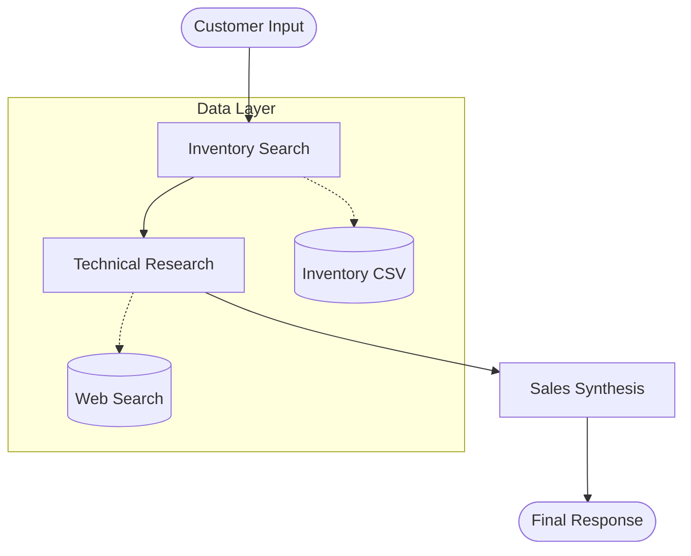
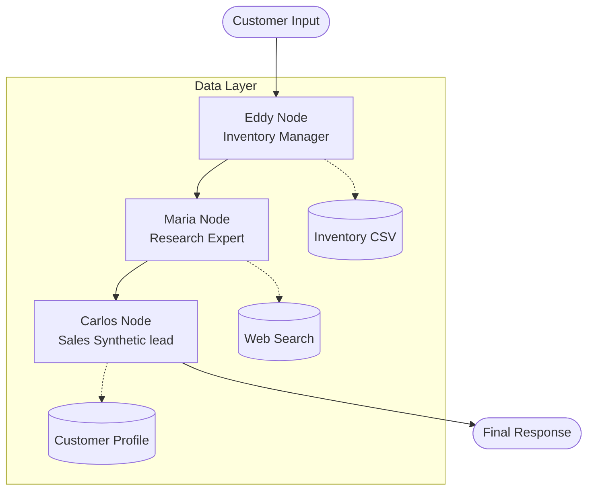
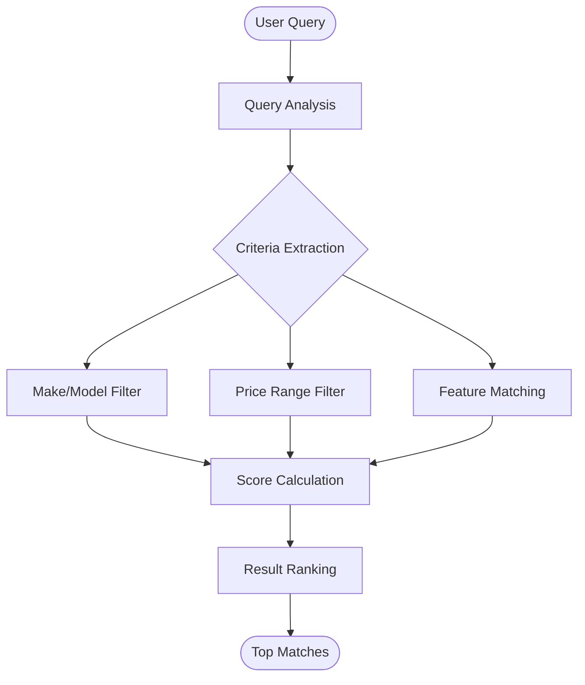
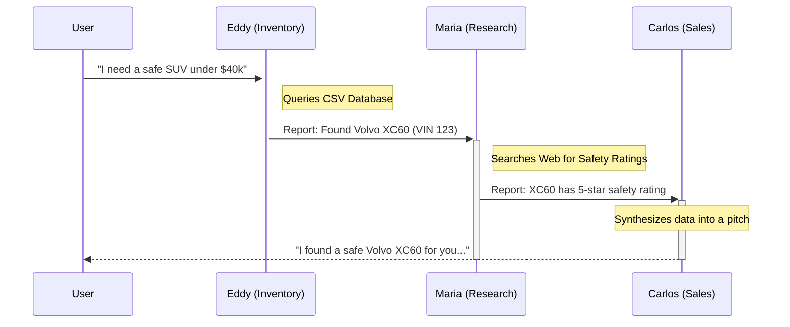
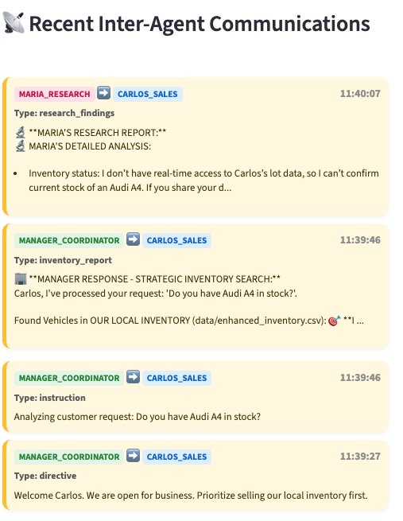
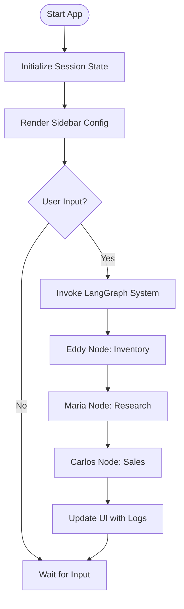
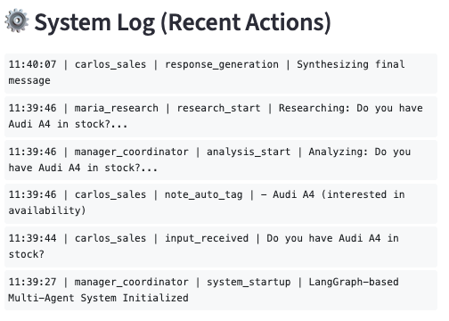
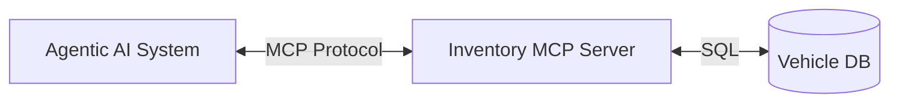
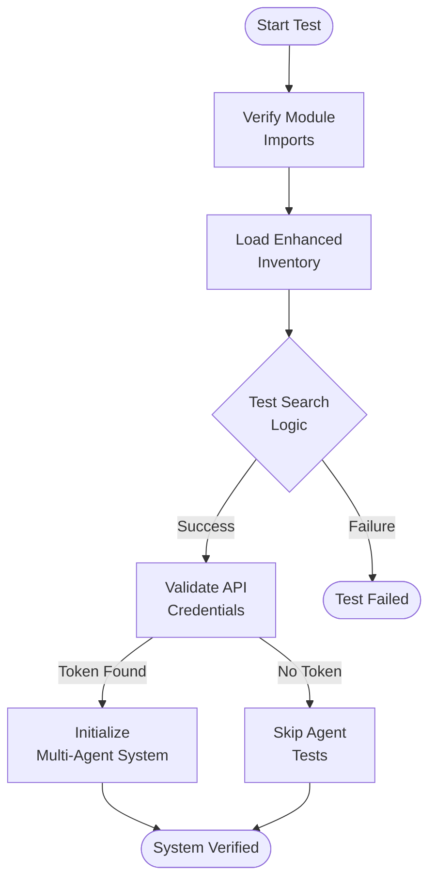

# The Agentic AI Playbook: From Concept to Production

_A comprehensive guide to understanding and building Agentic AI systems, illustrated by the "CarBot Pro" Multi-Agent System._

## 1. What is Agentic AI?

Traditional Generative AI (like ChatGPT) is passive: you ask a question, and it predicts the answer. **Agentic AI** is active: it has the ability to **reason, plan, and execute actions** to achieve a goal.

Think of the difference this way:

- **GenAI**: "Here is a news about cars." (Content Generation)
- **Agentic AI**: "I have checked the inventory, found three SUVs that match your budget, verified their safety ratings, and drafted a financing offer." (Task Execution)

This playbook explains the core concepts of Agentic AI using a real-world example: **CarBot Pro**, a multi-agent system designed for the automotive industry.

---

## 2. The Four Pillars of Agentic AI

Successful agentic systems are built on four main pillars: **Orchestration**, **Specialization**, **Tools**, and **State**.

### Pillar 1: Orchestration (The Brain)

Agents don't just "talk"; they follow a workflow. **Orchestration** is the logic that dictates which agent speaks when and how data flows between them. We often use **LangGraph** to build a **Directed Acyclic Graph (DAG)** of execution.

#### Visualizing the Workflow

The core of the system is a **Directed Acyclic Graph (DAG)** managed by LangGraph. The workflow follows a sequential path to ensure that the sales lead (Carlos) has all necessary data before responding to the customer.

**Logic Flow Diagram**
The following diagram illustrates the sequential execution of nodes within the LangGraph workflow.



**Workflow Execution Details**

1. **Eddy Node**: Analyzes the user query against the inventory data source (e.g., `enhanced_inventory.csv` or a live database) using the `InventoryManager`.
2. **Maria Node**: Performs technical research, potentially utilizing `SerpAPI` for external market data.
3. **Carlos Node**: Consumes the outputs from Eddy and Maria, updates the `CustomerProfile`, and generates the final natural language response.

### Pillar 2: Specialization (The Team)

Just as you wouldn't ask a mechanic to approve a loan, you shouldn't ask one LLM prompt to do everything. **Specialization** involves breaking a complex task into smaller, role-specific agents.

#### Agent Roles and Responsibilities

The system employs three distinct AI agents, each powered by specific Databricks-hosted models tailored for their respective tasks. This specialization prevents "hallucinations" by separating the concerns of inventory management, market research, and customer interaction.

| Agent      | Model                   | Primary Role        | Core Logic                                                                                   |
| :--------- | :---------------------- | :------------------ | :------------------------------------------------------------------------------------------- |
| **Eddy**   | `databricks-gpt-5-mini` | Inventory Manager   | Queries local CSV inventory, identifies VINs, and sets the sales strategy.                   |
| **Maria**  | `databricks-gpt-5`      | Research Specialist | Conducts technical deep-dives, safety rating lookups, and market comparisons via SerpAPI.    |
| **Carlos** | `databricks-gpt-5-1`    | Sales Lead          | Synthesizes all internal data into a customer-facing response, building rapport and closing. |

#### LangGraph Workflow Logic

The coordination logic follows a sequential execution pattern where the state is passed and augmented by each node.



### Pillar 3: Tools (The Hands)

An LLM without tools is just a brain in a jar. **Tools** allow agents to interact with the outside world (databases, APIs, the web).

#### Code Example: Defining an Inventory Tool

Eddy doesn't guess what cars are in stock; he calls `intelligent_search` to read from a real CSV database. This prevents **hallucinations**.

The underlying logic for this tool is not simple. It follows a structured "Intelligent Search" flow:



Here is the code example of that tool wrapper:

```python
"""
tools.py: Defining a Python tool for the agent.
"""
from typing import List, Dict, Annotated

# Mock database search function
def search_csv_database(query: str) -> List[Dict]:
    # In reality, this would query a pandas DataFrame or SQL DB
    return [{"vin": "123", "model": "Volvo XC90", "price": 45000}]

async def query_inventory_tool(
    search_query: Annotated[str, "The customer's vehicle requirements (e.g., 'SUV under 40k')"]
) -> List[Dict]:
    """
    Consults the inventory database to find available cars matching the criteria.
    """
    results = search_csv_database(search_query)
    return results
```

### Pillar 4: State (The Memory)

In a multi-step conversation, "who said what" matters. **State Management** tracks the context across different agents and turns.

#### Agent State Structure

The `AgentState` is a Python dictionary that accumulates data as it passes through the graph.

```python
"""
state.py: Defining the shared memory structure.
"""
from typing import TypedDict, List

class AgentState(TypedDict):
    input: str                       # Original user query
    chat_history: List[str]          # Previous conversation context

    # Internal Agent Outputs
    inventory_data: List[dict]       # What Eddy found
    research_data: str               # What Maria found

    final_response: str              # What Carlos will say
```

---

## 3. Communication Patterns: "Inter-Agent Dialogue"

Agents don't just pass raw data; they communicate directives and reports. Seeing this internal dialogue is crucial for debugging.

#### Sequence Diagram: The Hidden Conversation

Before the user gets an answer, the agents have a technical discussion:





---

## 4. Building the Graph (Orchestration Code)

Here is how you actually wire these components together using **LangGraph**. This code defines the nodes and the flow shown in the diagram above.

```python
"""
main.py: Wiring the agents into a graph.
"""
import asyncio
from langgraph.graph import StateGraph, END
from tools import query_inventory_tool

# 1. Define Nodes (The Agents)
async def eddy_node(state):
    print("--- Eddy: Checking Inventory ---")
    results = await query_inventory_tool(state["input"])
    return {"inventory_data": results}

async def maria_node(state):
    print("--- Maria: Researching Specs ---")
    # Maria checks the inventory data Eddy found
    cars_found = state.get("inventory_data", [])
    research = f"Safety ratings confirmed for {len(cars_found)} vehicles."
    return {"research_data": research}

async def carlos_node(state):
    print("--- Carlos: Synthesizing Response ---")
    response = "Here are the safe SUVs we have in stock..."
    return {"final_response": response}

# 2. Build the Graph
workflow = StateGraph(AgentState)

# Add Nodes
workflow.add_node("eddy", eddy_node)
workflow.add_node("maria", maria_node)
workflow.add_node("carlos", carlos_node)

# Add Edges (The Flow)
workflow.set_entry_point("eddy")
workflow.add_edge("eddy", "maria")
workflow.add_edge("maria", "carlos")
workflow.add_edge("carlos", END)

# 3. Compile
app = workflow.compile()
```

---

## 5. Observability: Seeing the "Brain" Work

When building Agentic systems, you must build a UI that lets you see the internal state.

The CarBot Pro system uses **Streamlit** to visualize the process:

1. **Sidebar**: Shows connection status to Databricks.
2. **Main Chat**: Shows the final conversation.
3. **Observability Panel**: A special expander that shows the _raw_ logs from Eddy and Maria.

**Why this matters**: If Carlos says "We have no cars," you need to check the logs. Did Eddy _really_ find zero cars, or did Carlos just fail to read the list? Observability answers that question.

#### UI Logic Flow Diagram

The Streamlit interface isn't just a display; it drives the interaction loop.



#### Observability Features

1. **Inter-Agent Communications**: A dedicated toggle in the UI (`show_agent_comms`) allows visibility into the raw messages exchanged between Eddy, Maria, and Carlos.
2. **System Logs**: Detailed logs track tool calls and sales stage transitions.
3. **Conversation Analytics**: Tracks total interactions, communication frequency, and customer profile completeness.



---

## 6. Quality Metrics and Analytics

You can't improve what you don't measure. In Agentic systems, traditional accuracy metrics aren't enough. You need to track the "health" of the agent's reasoning.

CarBot Pro tracks these specific metrics to quantify the quality of the sales interaction:

| Metric                   | Description                                                                      | Logic Source                        |
| :----------------------- | :------------------------------------------------------------------------------- | :---------------------------------- |
| **Profile Completeness** | Percentage of customer attributes (budget, needs, etc.) identified.              | `_calculate_profile_completeness()` |
| **Agent Communications** | Count of internal messages between nodes (e.g. Eddy talking to Maria).           | `get_conversation_analytics()`      |
| **Thinking Timeout**     | Tracking how often agents hit the 60s limit (indicates complex/stuck reasoning). | `_generate_timeout_fallback()`      |
| **Sales Stage**          | Current progression in the funnel (e.g., GREETING -> CLOSING).                   | `SalesStage` Enum                   |

**Why this matters**: High "Profile Completeness" usually correlates with higher conversion rates. If "Thinking Timeouts" spike, you know your prompt logic is too complex or the model is too slow.

---

## 7. Scaling with MCP (Model Context Protocol)

As your agentic system grows, you might need to connect to dozens of different tools: Github, Jira, PostGres, Google Drive, etc. Writing custom Python wrappers for every API is unscalable.

**Model Context Protocol (MCP)** solves this by providing a standard way for agents to "discover" and "use" tools from external servers.

### Architecture with MCP

Instead of hardcoding `query_inventory_tool`, the agent connects to an **MCP Server**.



### Why use MCP?

1. **Universal Connectivity**: Connect your agent to any MCP-compliant source (Slack, Git, Linear) without writing new adapter code.
2. **Security**: The MCP server handles authentication and data access, keeping your agent logic clean.
3. **Portability**: You can swap the underlying inventory database from CSV to SQL, and as long as the MCP server interface stays the same, the agent doesn't need to change.

### Example: Connecting to a Databricks MCP Server

In the context of our CarBot, we could replace our mock Python list with a real Databricks SQL Warehouse.

```python
# Instead of local tools, we load them from the server
from mcp import Client

async def main():
    # Connect to the MCP Server
    async with Client("https://inventory-mcp.databricks.net") as client:

        # The agent automatically "sees" the available tools
        tools = await client.list_tools()
        print(f"Available Tools: {tools}")

        # The Agent can now call 'query_inventory' directly on the server
        agent = Agent(tools=tools)
        response = await agent.run("Find me a white SUV")
```

---

## 8. Reliability: System Verification Flow

Before deploying an agent to production, you must verify that its "brain" and "limbs" are connected. A single broken API token can crash the entire system.

CarBot Pro runs a boot-up sequence to verify system integrity:



**Key Checkpoints:**

1. **Inventory Load**: Can we actually read the CSV? (Prevents "DB Connection Failed" errors).
2. **Search Logic**: Does `intelligent_search("prosche")` return results? (Verifies Fuzzy Logic).
3. **Authentication**: Is the Databricks Token valid? (Prevents 401 Unauthorized errors during runtime).

---

## 9. Summary: Best Practices

1. **Don't start with one Agent**: Break your problem into roles (Pillar 2).
2. **Tool usage is mandatory**: Use tools to ground your agents in reality (Pillar 3).
3. **Design the State first**: Define your `TypedDict` before writing prompts (Pillar 4).
4. **Visualize**: Use Mermaid charts and Streamlit logs to debug the orchestration (Pillar 1 & 5).
5. **Scale with MCP**: Use the Model Context Protocol to manage complex tool integrations (Section 7).
6. **Verify Integrity**: Run automated health checks before letting users interact (Section 8).
